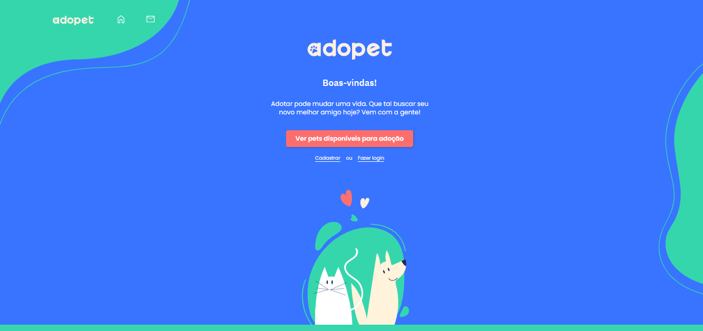

<h1 align="center"> Testes automatizados usando Cypress do site AdoPet   🐶💙🐱 </h1>

Projeto realizado no curso de
"Cypress: automatizando testes E2E", disponibilizado pela Alura   

  <a href="#-tecnologias">Tecnologias</a>&nbsp;&nbsp;&nbsp;&nbsp;&nbsp;&nbsp;

 

  

## 🚀 Tecnologias

- JavaScript
- Cypress
- Mochawesome

## 💻 Projeto

Projeto realizado durante o curso de
"Cypress: automatizando testes E2E" da Alura. 

---
